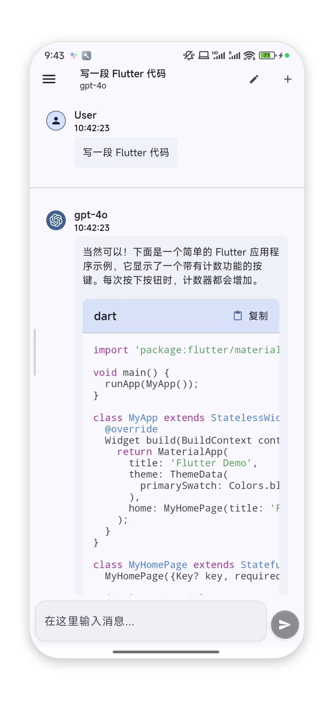
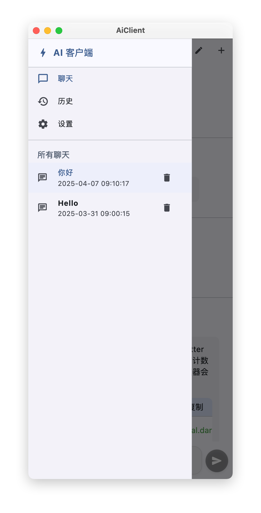
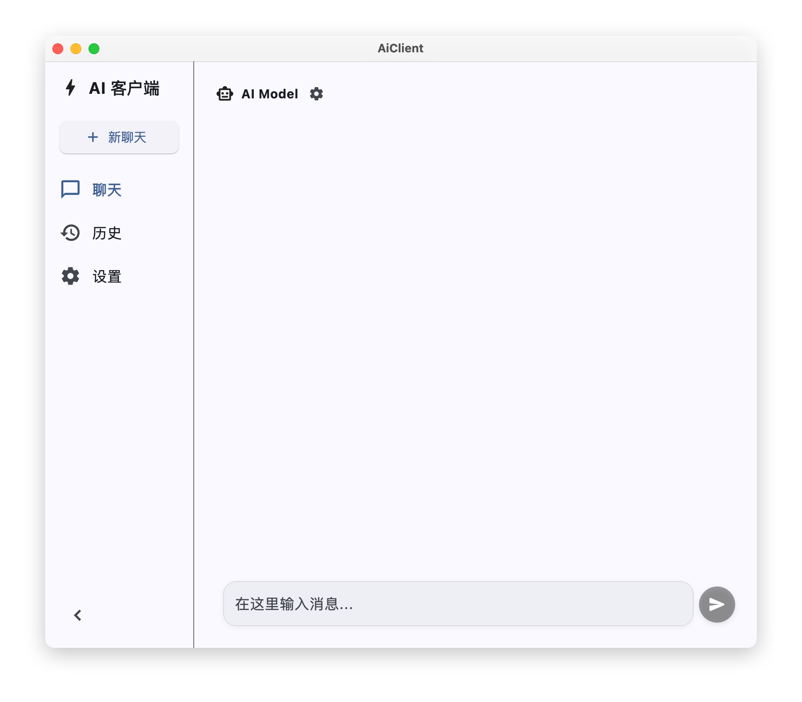
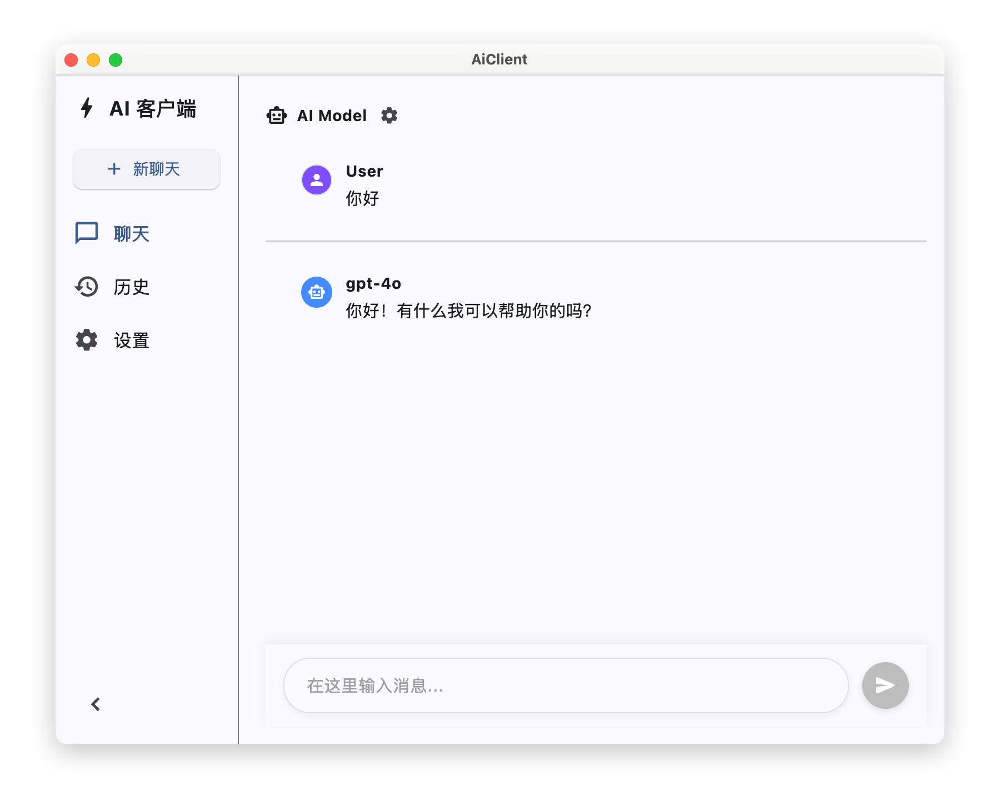
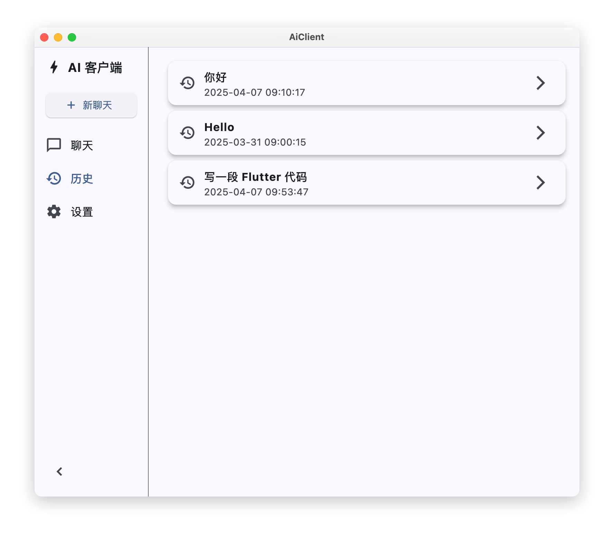
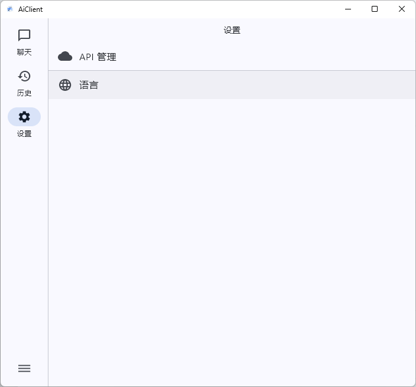
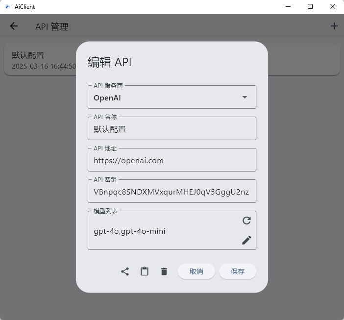

# AiClient

AiClient 是一个跨平台的 AI 聊天客户端应用程序，支持多种 AI API 服务商和多语言界面。

## 功能预览
### 移动端



### 桌面端







## 技术栈

- 使用 Flutter/Dart 开发
- 支持 Android、iOS、Windows、macOS、Linux、Web 平台

## TODO

- 消息回复中时中断回复
- 消息重发保存上一条消息
- 聊天附件功能

## 本地开发指南

### 环境要求
```yaml
  Flutter: ">=3.0.0 <4.0.0"
  Dart: ">=3.0.0 <4.0.0"
  MacOS: macOS 10.15+（用于macOS开发）
  iOS: Xcode 13.0+（用于iOS开发）
  Android: Android SDK（用于Android开发）
```

### 1. 项目获取配置

#### 1.1 克隆项目
```bash
# 克隆项目
git clone https://github.com/HRET-Dev/AiClient.git

# 进入项目
cd AiClient
```
#### 1.2 安装依赖
```bash
flutter pub get
```

### 2. ios、Android 平台特定配置
<details>
<summary>Android 配置</summary>
</br>

  #### 2.1 环境要求
  ```yaml
  Jdk: 17+
  ```

  #### 2.2 生成签名文件 跟随提示输入即可
  **PS：请牢记输入的密钥库口令和密钥口令**
  ```bash
  keytool -genkeypair -alias aiclient-key -keyalg RSA -keysize 2048 -validity 36500 -keystore android/app/aiclient-keystore.p12 -storetype PKCS12
  ```

  #### 2.3 配置签名文件
  ```bash
  cat <<EOF > android/key.properties
  storePassword=密钥库口令
  keyPassword=密钥口令
  keyAlias=aiclient-key
  storeFile=../app/aiclient-keystore.p12
  EOF
  ```

</details>

### 🎉 运行项目
```bash
# 运行项目
flutter run
```